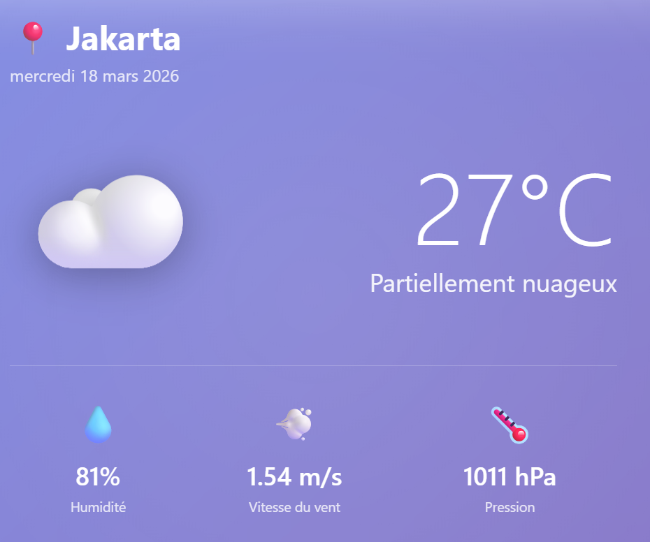
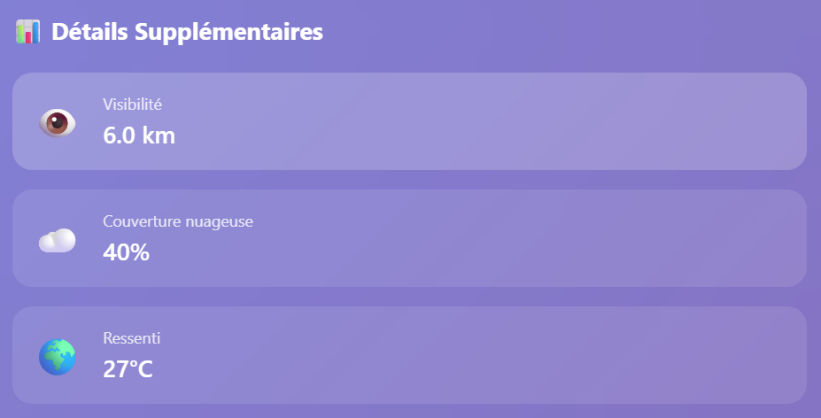
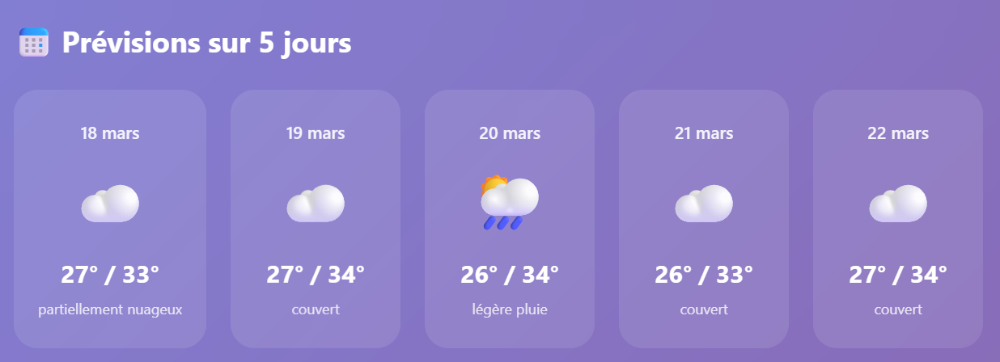

# MeteoApp — Prévisions Météo en Temps Réel


<p align="center">
  <b>Application météo en temps réel — recherchez la météo de n'importe quelle ville du monde, avec prévisions sur 5 jours.</b>
</p>


##  Fonctionnalités

| Fonctionnalité | Description |
|---|---|
|  **Recherche par ville** | Recherchez la météo de n'importe quelle ville dans le monde |
|  **Géolocalisation** | Détection automatique de votre position actuelle |
|  **Actualisation** | Mise à jour des données en un clic |
|  **Météo actuelle** | Température, condition, humidité, vent, pression |
|  **Détails avancés** | Visibilité, couverture nuageuse, ressenti |
|  **Lever/coucher du soleil** | Horaires précis selon la ville |
|  **Prévisions 5 jours** | Températures min/max et conditions par jour |
|  **Responsive** | Adapté mobile, tablette et desktop |

---

##  Technologies

- **HTML5** — Structure de la page
- **CSS3** — Glassmorphism, animations, responsive design
- **JavaScript (Vanilla)** — Logique et appels API
- **[OpenWeatherMap API](https://openweathermap.org/api)** — Données météo en temps réel

---

##  Installation

Aucune dépendance, aucun framework — juste un fichier HTML.
```bash
# Clone le repository
git clone https://github.com/MAIRImanar/meteoapp.git
cd meteoapp

# Ouvre dans le navigateur
open index.html
# ou double-clique simplement sur index.html
```

---

##  Configuration API

L'application utilise l'API **OpenWeatherMap** (plan gratuit suffisant).

1. Crée un compte sur [openweathermap.org](https://openweathermap.org/api)
2. Génère une clé API gratuite
3. Remplace la clé dans `index.html` :
```javascript
const API_KEY = 'VOTRE_CLE_API_ICI';
```

>  Ne commit jamais ta vraie clé API sur un repo public.

---

## 📁 Structure du projet
```
meteoapp/
├── index.html           # Application complète (HTML + CSS + JS)
├── screenshots/
│   ├── search.png       # Capture barre de recherche
│   ├── current.png      # Capture météo actuelle
│   ├── details.png      # Capture détails supplémentaires
│   ├── sun.png          # Capture lever/coucher du soleil
│   └── forecast.png     # Capture prévisions 5 jours
└── README.md
```
---

##  Aperçu

###  Recherche


###  Météo Actuelle — Jakarta


### Détails Supplémentaires


###  Lever & Coucher du Soleil


###  Prévisions sur 5 Jours


---


---

##  Auteur

 MAIRI  Manar 
[@MAIRImanar](https://github.com/MAIRImanar) |

---

##  License

Ce projet est open source sous licence [MIT](LICENSE).

---

<p align="center">Made with ❤️ by <a href="https://github.com/MAIRImanar"><strong>MAIRImanar</strong></a></p>
